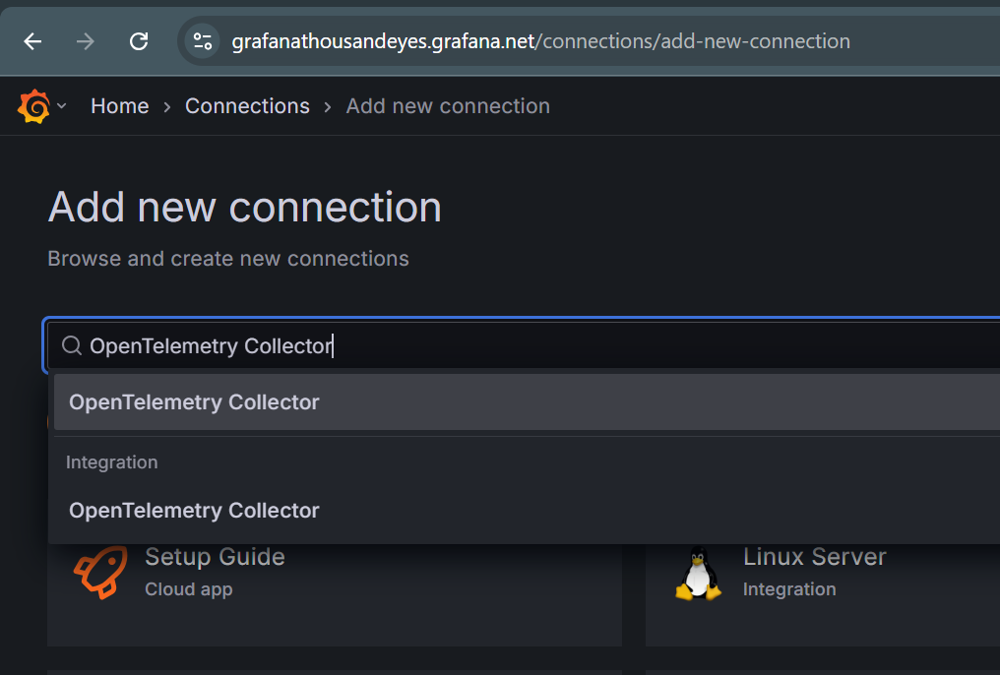
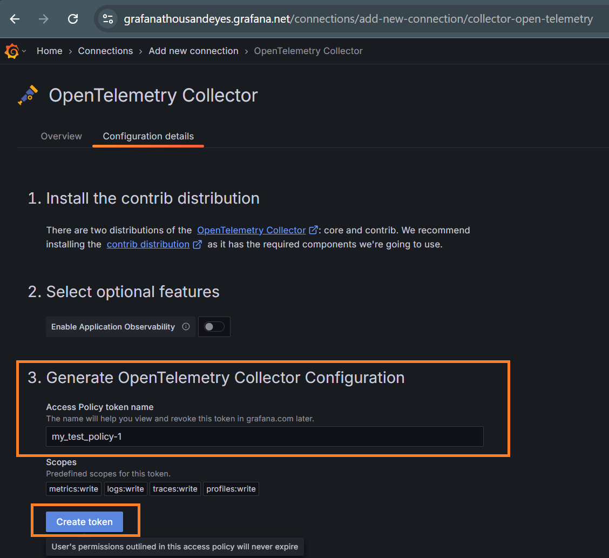
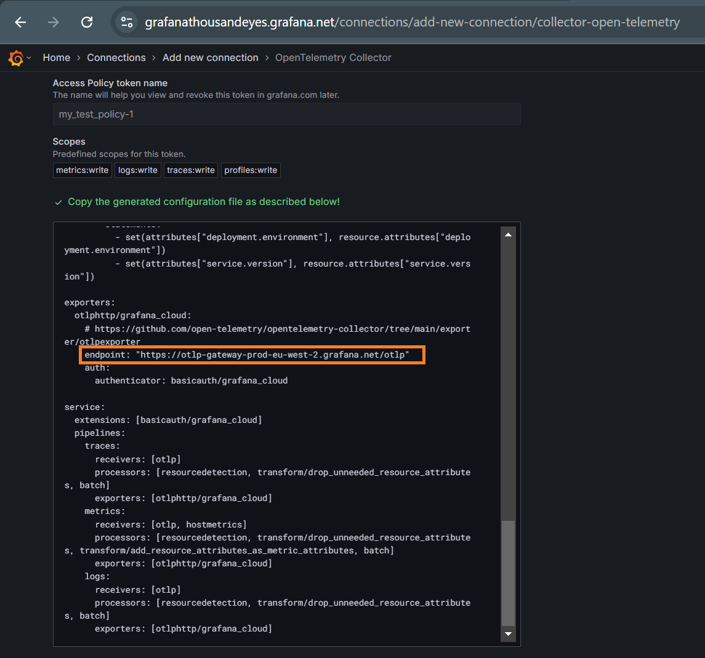
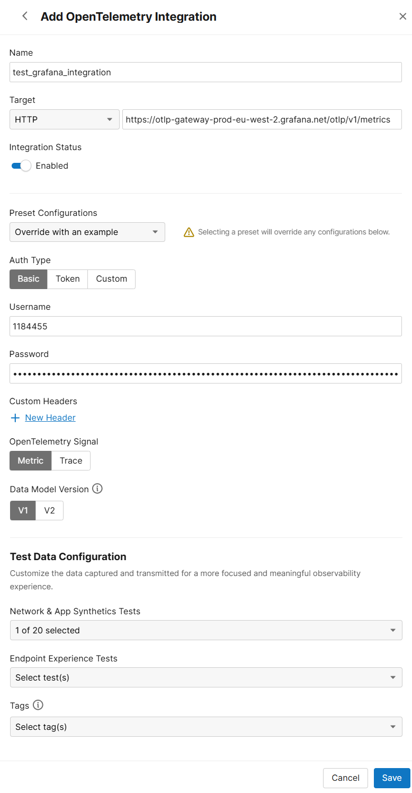

# observability-dashboards

## Description

ThousandEyes Grafana Dashboard provides deep insights into the performance and health of your network infrastructure and applications. By integrating ThousandEyes with Grafana via OpenTelemetry, users can monitor key metrics from ThousandEyes tests and present them in an easy-to-understand visual format. The dashboard enables you to analyze network performance, application performance, and the overall health of your digital experience.

### Prerequisites:
* A running instance of Grafana (Cloud or On-prem).
    * Note, that for On-prem deployments, you would need to have a Prometheus installed separately. More information and guidance [can be found here](https://www.thousandeyes.com/blog/stream-thousandeyes-data-prometheus).
* ThousandEyes account with configured tests
* OpenTelemetry integration between ThousandEyes and Grafana (Prometheus/Mimir)

### Supported metrics
[This document](https://docs.thousandeyes.com/product-documentation/integration-guides/custom-built-integrations/opentelemetry#support) contains up-to-date list of supported ThousandEyes test types and metrics.

## Configuration steps

### Grafana

1. Navigate to [Connections] > [Add new connection] and search for “OpenTelemetry Collector”

    

2. Enter a token name in the provided field, then click [Create token]

    

    * Once the token is successfully created, you will get an endpoint URL. This URL will be required for the configuration on the ThousandEyes side. Note, that you will need to add /v1/metrics to the end of that URL. For example: https://otlp-gateway-prod-eu-west-2.grafana.net/otlp/v1/metrics

    

    * In addition to the URL, you will also get authentication details (username and password). This authentication details will be required for the configuration on the ThousandEyes side.

    

### ThousandEyes

1. [This document](https://docs.thousandeyes.com/product-documentation/integration-guides/custom-built-integrations/opentelemetry/configure-opentelemetry-streams/ui) contains the necessary steps for configuring OpenTelemetry integration on ThousandEyes
* On the ThousandEyes platform, navigate to [Integrations] > [New Integration] > [ThousandEyes for OpenTelemetry]
* In the configuration section, provide Grafana details (URL and authentication) and select which ThousandEyes tests you want to enable OpenTelemetry for. Here is the example screenshot of configuration:

    
