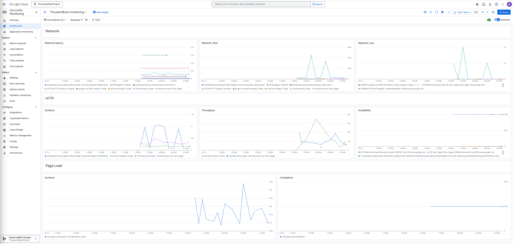

# ThousandEyes Dashboards

This repository contains  dashboards representing ThousandEyes telemetry data for different observability backends.

### Splunk Observability Cloud

[Splunk Observability Cloud Dashboard](splunk/ThousandEyesDashboard.json)

### Grafana

[Grafana Dashboard](grafana/ThousandEyesDashboard.json)

[Setup Guide](grafana/grafana-setup.md)

### DataDog

[DataDog Dashboard](datadog/ThousandEyesDashboard.json)

### Dynatrace

[Dynatrace Dashboard](dynatrace/ThousandEyesDashboard.json)

### New Relic

[New Relic Dashboard](newRelic/ThousandEyesDashboard.json)
[Setup Guide](newRelic/newrelic-setup.md)

### Signoz

[Signoz Dashboard](signoz/ThousandEyesDashboard.json)

### Google Cloud Monitoring

[Google Cloud Monitoring Dashboard](googleCloudMonitoring/ThousandeyesDashboard.json)

[Setup Guide](https://github.com/antonjim-te/thousandeyes-google-cloud-integration)

